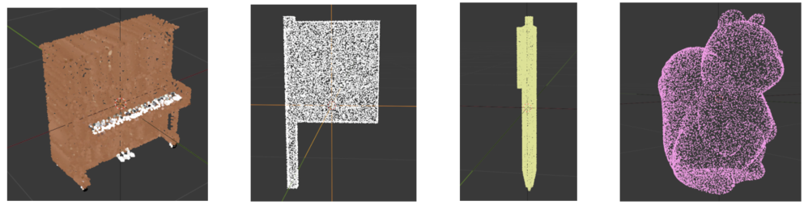

# 🪐 Objaverse-XL Download and Rendering Script for Point Cloud


Scripts for rendering Objaverse-XL with [Blender](https://www.blender.org/). Rendering is the process of taking pictures of the 3D objects. These images can then be used for training AI models.

## 🖥️ Setup

1. Clone the repository and enter the rendering directory:

```bash
git clone https://github.com/Qi-Zhangyang/Objaverse-xl_Download.git
```

2. Download Blender:
[blender_3.2 and its pillow has been installed](https://drive.google.com/file/d/1Prb0XN3sxX7ncVj0E3l_4M8IINFlOwB4/view?usp=sharing)
You should download it into and unzip it in the rendering_objaverse_xl directory. The folder structure can be seen in the Sec. ***Annotations of Objaverse-XL***

3. Install the Python dependencies. Note that Python >3.8 is required:

```bash
conda create -n objaxl_dl && \
conda activate objaxl_dl && \
pip install -r requirements.txt && \
pip install -e .
```

If is shown that: Module Not Found Error: No module named 'objaverse'
You can pip install objaverse again:

```bash
pip install objaverse --upgrade --quiet
```

### 📋 Annotations of Objaverse-XL

You can download the annotation files [here](https://drive.google.com/drive/folders/1OJOC9um_8LMvNZFKMkdEe9spzXvK3k2X?usp=drive_link).

The folder structure is as follows:
```
GPT4Point
├── Objaverse-xl_Download
│ ├── blender-3.2.2-linux-x64
│ ├── download.py
│ ├── annotations
│ │ ├── ann.json
│ │ ├── first_5w_rows.json
│ │ ├── first_5w_postprocess.json
│ │ ├── first5w_500_per_file
│ │ │ ├── first5w_500_per_file_1.json
│ │ │ ├── first5w_500_per_file_2.json
│ │ │ ├── first5w_500_per_file_3.json
```
***ann.json***: Raw annotations for all 9.7M objects.<br>
***first_5w_rows.json***: Raw annotations for the first 50,000 objects.<br>
***first_5w_postprocess.json***: Processed annotations for the first 50,000 objects.<br>
***first5w_500_per_file*** Splits first_5w_postprocess.json into individual JSON files, each containing 500 objects. Here, we provide the download link for the first 50,000 objects.


## 📸 Download

**Note that you should cd in the Objaverse-xl_Download directory.**

```bash
cd ./Objaverse-xl_Download
```


1. Single Machine:

After setup, we can start to render objects using the `download.py` script:

```bash
python3 download.py --gpu_devices=0 --processes=1 --json_file=annotations/first5w_500_per_file/first5w_500_per_file_1.json --render_dir=./render_dir --temp_dir=./temp_dir
```

2. Slurm:
If you use the slurm system, you can run it with:

```bash
srun -p <PARTITION> \
    --job-name=<JOB_NAME> \
    --gres=gpu:<GPUS_PER_NODE> \
    --ntasks-per-node=<NTASK_PER_NODE> \
    --ntasks=<TASKS> \
    --cpus-per-task=<CPUS_PER_TASK> \
    --kill-on-bad-exit=1 \
    python download.py <PY_ARGS>
```

For example:
```bash
srun -p llmeval2 \
    --job-name=render \
    --quotatype=spot \
    --gres=gpu:2 \
    --ntasks-per-node=2 \
    --ntasks=4 \
    --cpus-per-task=8 \
    --kill-on-bad-exit=1 \
    python download.py --json_file=annotations/first5w_500_per_file/first5w_500_per_file_1.json --render_dir=./render_dir --temp_dir=./temp_dir
```

### 🎛 Configuration
Inside of `download.py` there is a `render_objects` function that provides various parameters allowing for customization during the rendering process:

- `render_dir: str = "./render_dir"`: The directory where the objects will be rendered results.
- `num_renders: int = 20`: The number of renders to save for each object. Defaults to `20`, for the generation of the point cloud.
- `processes: Optional[int] = None`: The number of processes to utilize for downloading the objects. If left as `None` (default), it will default to `multiprocessing.cpu_count() * 3`.
- `save_repo_format: Optional[Literal["zip", "tar", "tar.gz", "files"]] = None`: If specified, the GitHub repository will be deleted post rendering each object from it. Available options are `"zip"`, `"tar"`, and `"tar.gz"`. If `None` (default), no action is taken.
- `only_northern_hemisphere: bool = False`: If `True`, only the northern hemisphere of the object is rendered. This is useful for objects acquired via photogrammetry, as the southern hemisphere may have holes. Default is `False`.
- `render_timeout: int = 300`: Maximum number of seconds to await completion of the rendering job. Default is `300` seconds.
- `gpu_devices: Optional[Union[int, List[int]]] = None`: Specifies GPU device(s) for rendering. If an `int`, the GPU device is randomly chosen from `0` to `gpu_devices - 1`. If a `List[int]`, a GPU device is randomly chosen from the list. If `0`, the CPU is used. If `None` (default), all available GPUs are utilized.


## 🤖 Rendering Results
After running this, you should see 10 zip files located in `./render_dir/renders`. Each zip file corresponds to the rendering of a unique object:

```bash
> ls ./render_dir/renders
0fde27a0-99f0-5029-8e20-be9b8ecabb59.zip  54f7478b-4983-5541-8cf7-1ab2e39a842e.zip  93499b75-3ee0-5069-8f4b-1bab60d2e6d6.zip
21dd4d7b-b203-5d00-b325-0c041f43524e.zip  5babbc61-d4e1-5b5c-9b47-44994bbf958e.zip  ab30e24f-1046-5257-8806-2e346f4efebe.zip
415ca2d5-9d87-568c-a5ff-73048a084229.zip  5f6d2547-3661-54d5-9895-bebc342c753d.zip
44414a2a-e8f0-5a5f-bb58-6be50d8fd034.zip  8a170083-0529-547f-90ec-ebc32eafe594.zip
```

If we unzip one of the zip files:

```bash
> cd render_dir/renders
> unzip 0fde27a0-99f0-5029-8e20-be9b8ecabb59.zip
```

we will see that there is a new `0fde27a0-99f0-5029-8e20-be9b8ecabb59` directory. If we look in that directory, we'll find the following files:

```bash
> ls 0fde27a0-99f0-5029-8e20-be9b8ecabb59
metadata.json
000.png  001.png  002.png  ...  019.png
000_depth.png  001_depth.png  002_depth.png  ...  019_depth.png
000_MatAlpha.png  001_MatAlpha.png  002_MatAlpha.png  ...  019_MatAlpha.png
000.json  001.json  002.json  ...  019.json
```

## 🌈 Extracting Colorful Point Clouds
See [extract_pointcloud](./shap-e/) in details.

