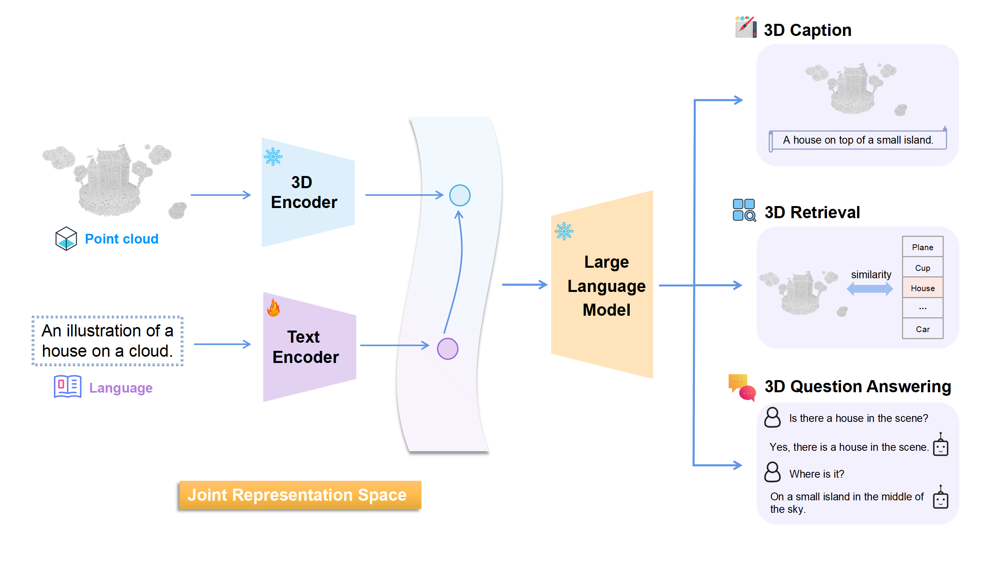
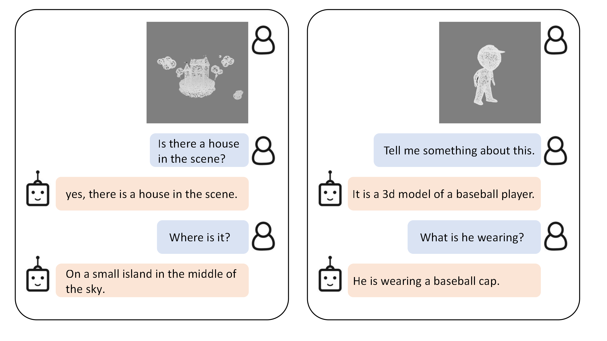

# PointBLIP: A Point Cloud Multi-modal model Embracing Diverse Data without Reliance on Image Domain

<p align="center">
  	<a href="https://img.shields.io/badge/version-v0.1.0-blue">
      
    </a>
  <a >
       
  	</a>
  <a >
       
  	</a>
    <br />
</p>

##  Overview

This project presents **PointBLIP**<a>   </a>, a 3D multi-modality model that aligns **3D point clouds** with **language** inspired by 2D-multimodal model BLIP. 

- We directly align the representation of point cloud and language **without the need to align with image modality additionally as classical methods**. 
- Furthermore, we explore the great potential of point clouds for various tasks on 3D multimodal understanding and generation.

## :fire:Demos
<p align="center"> <a>  
 
</a> </p>

These demo shows the 3D captions of objects in the **Objaverse**. 
- The first line is the mesh of the objects. The second line is the point cloud of them without the color.
- <span style="color: grey;">Grey captions.</span> are generated by the BLIP when provided with a view of object images.
- White captions are generated by the PointBLIP when provided with only the point clouds.

Observably, the white captions exhibit a greater capacity to convey intricate details concerning the objects' geometrical attributes.


##  News

🔥 2023/08/13:  Two-stage Pre-training code of PointBLIP has been released.

🔥 2023/08/13:  All datasets used and result files has been uploaded.


##  PointBLIP

### Previous method ULIP：
<p align="center">  <a>   </a> </p>


### Our PointBLIP：

<p align="center">  <a>   </a> </p>

*ULIP* is a representative work on aligning point clouds with other modality information (Upper part). However, it needs to align 3D point clouds with both images and texts during training just to make the model gain the ability of 3D semantic understanding. 

To simplify this approach, our ${\ PointBLIP\ }$ considers directly aligning texts with 3D point clouds (Lower part). Besides, we add an LLM(Large Language Model) to the basis of joint representation learning, which fully promote the combination of 3D point cloud and text representation, and successfully apply to multiple downstream tasks.

Our PointBLIP demonstrates 3 key attributes:

- $\color{darkorange}{Directly\ Align\ Texts\ with\ 3D\ Point\ Clouds\ .}$ To improve the recognition ability and semantic understanding of 3D backbone models,   we directly align the representation of 3D point clouds and texts. We doesn't introduce additional infomation of image representions during training, which simplifies the training process and fully aligns the representations.
- $\color{darkorange}{Bridge\ Modality\ Gap\ Guided\ By\ BLIP2\ .}$ Inspired by 2D multi-modality model *BLIP2*, we ingeniously utilize both pretrained 3D point cloud models and large language models. We bridge the modality gap between 3D point clouds and texts using a trainable module (text encoder in the figure) pretrained in two-stages.
- $\color{darkorange}{LLM\ Empowers\ a\ Wide\ Range\ of\ 3D\ Semantic\ Tasks\ .}$  Incorporating the large language model enables the capability to perform a broader spectrum of 3D semantic understanding and genaration tasks. Besides engaging in a 3D classification task directly using the trained representations, ***PointBLIP*** can perform 3D caption generation, 3D retrieval and 3D question answering tasks, fully exploring the semantic capabilities of 3D point clouds


##  3D Caption
Given the input of a 3D point cloud, the caption generated by our PointBLIP can better reflect the **structural features**, **orientation** and more **details** of the object.
<p align="center"> <a>  

</a> </p>

Demos at the outset are identical to the initial demos. <span style="color: grey;">Grey captions</span> are produced by the BLIP when presented with object image views, while white captions are generated by the PointBLIP using only point clouds.

##  Point Cloud QA

Given 3D point cloud and text input,  PointBLIP can generate answers to questions interactively.

<p align="center">  <a>   </a> </p>


##  Get Started

### Preparation

#### 1. Install [salesforce-lavis](https://github.com/salesforce/LAVIS)

```shell
$ conda create -n lavis python=3.8
$ conda activate lavis

$ git clone https://github.com/salesforce/LAVIS.git SalesForce-LAVIS
$ cd SalesForce-LAVIS
$ pip install -e .

$ pip install positional_encodings
```

#### 2. Prepare the dataset

We use **Objaverse** (80k objects) to train and evaluate models. We use the point cloud and text description label provided by ULIP2. You can download the datasets directly [here](https://console.cloud.google.com/storage/browser/sfr-ulip-code-release-research).


```text
pointblip
├── figure
├── lavis
├── data
│ ├── objaverse_pc_parallel
│ ├── merged_data_new.json
│ ├── common_ids.text
```

#### 3. convert dataset into training format

the abs path of converted dataset should be registered in `lavis/configs/default.yaml` as `cache_root`


### Training

```shell
$ conda activate lavis
# use facebook/opt-2.7b:
# stage 1:
$ python -m torch.distributed.run --nproc_per_node=8 train.py --cfg-path lavis/projects/point_blip/train/pretrain_stage1_point_obja.yaml
# stage 2:
$ python -m torch.distributed.run --nproc_per_node=8 train.py --cfg-path lavis/projects/point_blip/train/pretrain_stage2_point_obja.yaml
```
before stage2 training, you need to place stage1 trained checkpoint under `model` dir and change the corresponding config path.


### Evaluation

```shell
$ python -m torch.distributed.run --nproc_per_node=8 evaluate.py --cfg-path lavis/projects/point_blip/eval/caption_objaverse_opt2.7b_eval.yaml
```

result will be saved as `.json` file in `lavis/output` with following formats:

```json
[
    {
        "image_id": "object hash id of objaverse",
        "2d_caption": "gt caption when training BLIP-3D",
        "caption": "generated caption by BLIP-3D"
    },
    
]
```
