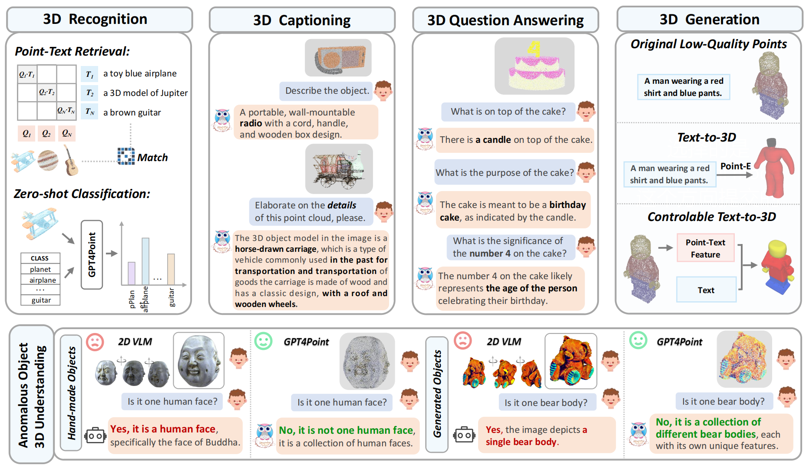
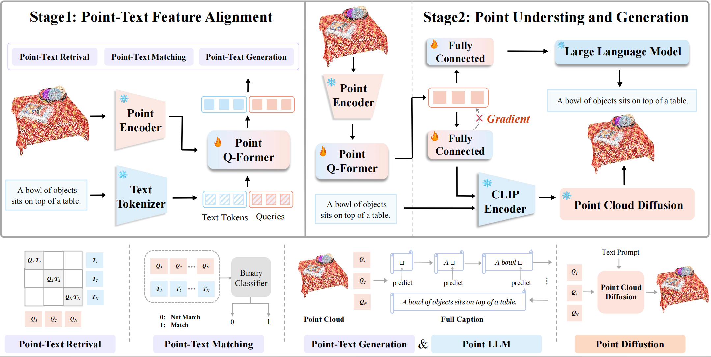
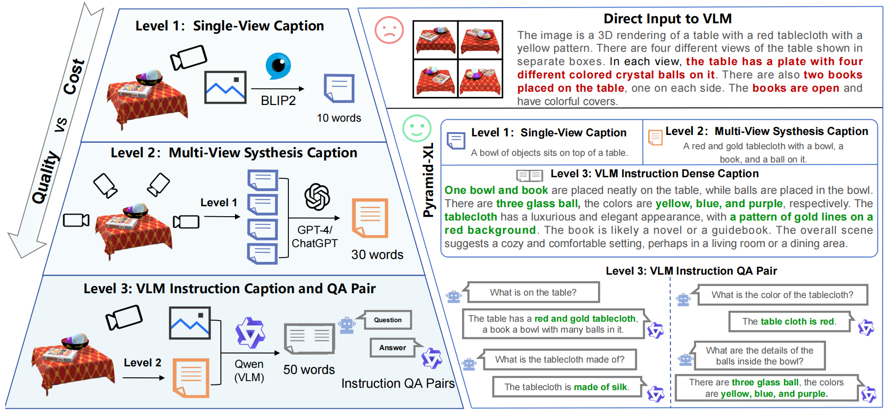

# GPT4Point<a>   </a>: A Unified Framework for Point-Language Understanding and Generation

<p align="center">
  	<a href="https://img.shields.io/badge/version-v0.1.0-blue">
      
    </a>
  <a >
       
  	</a>
  <a >
       
  	</a>
    <br />
</p>

##  News

🔥 2023/12/05:  The paper [GPT4Point (arxiv)](https://arxiv.org/abs/2312.02980) has been released, we unified the Point-language Understanding and Generation.

🔥 2023/08/13:  Two-stage Pre-training code of PointBLIP has been released.

🔥 2023/08/13:  Part of datasets used and result files has been uploaded.

## 🏠 Overview
<p align="center">  <a>   </a> </p>

This project presents **GPT4Point**<a>   </a>, a 3D multi-modality model that aligns **3D point clouds** with **language**. More details are shown in [project page](https://gpt4point.github.io/).

- **Unified Framework for Point-language Understanding and Generation.** We present the unified framework for point-language understanding and generation GPT4Point, including the 3D MLLM for point-text tasks and controlled 3D generation.

- **Automated Point-language Dataset Annotation Engine Pyramid-XL.** We introduce the automated point-language dataset annotation engine Pyramid-XL based on Objaverse-XL, currently encompassing 1M pairs of varying levels of coarseness and can be extended cost-effectively.

- **Object-level Point Cloud Benchmark.** Establishing a novel object-level point cloud benchmark with comprehensive evaluation metrics for 3D point cloud language tasks. This benchmark thoroughly assesses models' understanding capabilities and facilitates the evaluation of generated 3D objects.

## 📦 Model and Data Engine

### 1. Architechure (Training Pipeline)
<p align="center">  <a>   </a> </p>

The model architecture of GPT4Point for training. In Stage1, we employ a Bert-based Point-Q-Former for point-text feature alignment through three point-text tasks. Then, in Stage2, an LLM is appended to train the model's text inference capabilities. A Point Cloud Diffusion is attached separately to train controlled text-to-3D generation which keeps the geometry shape and colors.

### 2. Pyramid-XL: An automated point-text annotation engine
<p align="center">  <a>   </a> </p>
Pyramid-XL: An automated point-text annotation engine. Directly inputting images into VLMs yields unsatisfactory results. We propose a progressive annotation approach with 3 levels of granularity, leveraging results from the previous level for precise outcomes.

## 🤖 Demos

### 1. Video Demos
Given the input of a 3D point cloud, the caption generated by our GPT4Point can better reflect the **structural features**, **orientation** and more **details** of the object.
<p align="center"> <a>  
 
</a> </p>


<p align="center"> <a>  

</a> </p>

These demo shows the 3D captions of objects in the **Objaverse**. 
- The first line is the mesh of the objects. The second line is the point cloud of them without the color.
- <span style="color: grey;">Grey captions.</span> are generated by the BLIP when provided with a view of object images.
- White captions are generated by the GPT4Point when provided with only the point clouds.

Observably, the white captions exhibit a greater capacity to convey intricate details concerning the objects' geometrical attributes.


### 2. Long Caption and Question & Answering
***Examples of text inference using the GPT4Point with ViT-g and OPT6.7B after Instruct Finetuning.*** The table showcases its proficiency with point cloud input, excelling in tasks like detailed caption generation and point cloud-bas question answering. This underscores our model's profound grasp of point cloud geometry and color, translating them into meaningful semantics.
<p align="center"> <a>  

</a> </p>

<p align="center"> <a>  

</a> </p>

### 3. Detect Anomalous Objects(Generation Failure Cases)
***Anomalous Objects: Generation Failure Cases.*** The upper and lower parts respectively depict the performance of 2D MLLM and GPT4Point in identifying abnormally generated objects with multi-body and multi-head structures. GPT4Point is effective in making accurate judgments, whereas 2D MLLM, due to the lack of information from single-view images, fails to identify most cases.
<p align="center"> <a>  

</a> </p>

### 4. Point Diffusion Results
***Point Diffusion Results: our controllable text-to-3D***Given a low-quality point cloud prior, it can generate outcomes superior to direct text-to-3D and image-to-3D methods and more closely align with the low-quality priors, demonstrating controllability.

<p align="center"> <a>  

</a> </p>

## 📝 TODO List
- [✔] Release the arxiv and the project page.
- [ ] Release dataset and data engine.
- [ ] Add inferencing codes with checkpoints.
- [ ] Add Huggingface Demo🤗.
- [ ] Add training codes.
- [ ] Add evaluation codes.
- [ ] Add gradio demo codes.


## 🔗 Citation

If you find our work helpful, please cite:

```bibtex
@misc{qi2023gpt4point,
  title={GPT4Point: A Unified Framework for Point-Language Understanding and Generation}, 
  author={Zhangyang Qi and Ye Fang and Zeyi Sun and Xiaoyang Wu and Tong Wu and Jiaqi Wang and Dahua Lin and Hengshuang Zhao},
  year={2023},
  eprint={2312.02980},
  archivePrefix={arXiv},
  primaryClass={cs.CV}
}
```


## 📄 License
<a rel="license" href="http://creativecommons.org/licenses/by-nc-sa/4.0/"></a>
<br />
This work is under the <a rel="license" href="http://creativecommons.org/licenses/by-nc-sa/4.0/">Creative Commons Attribution-NonCommercial-ShareAlike 4.0 International License</a>.


## 📚 Related Work
Together, Let's make LLM for 3D great!
- [Point-Bind & Point-LLM](https://arxiv.org/abs/2309.00615): It aligns point clouds with Image-Bind to reason multi-modality input without 3D-instruction data training.
- [3D-LLM](https://arxiv.org/abs/2307.12981): employs 2D foundation models to encode multi-view images of 3D point clouds.
- [PointLLM](https://arxiv.org/abs/2308.16911): employs 3D point clouds with LLaVA.
